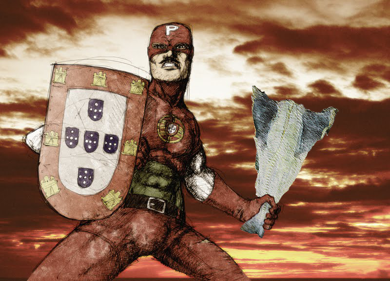
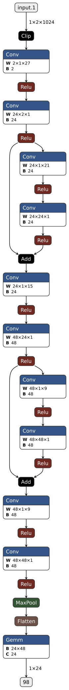
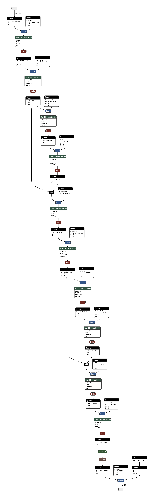
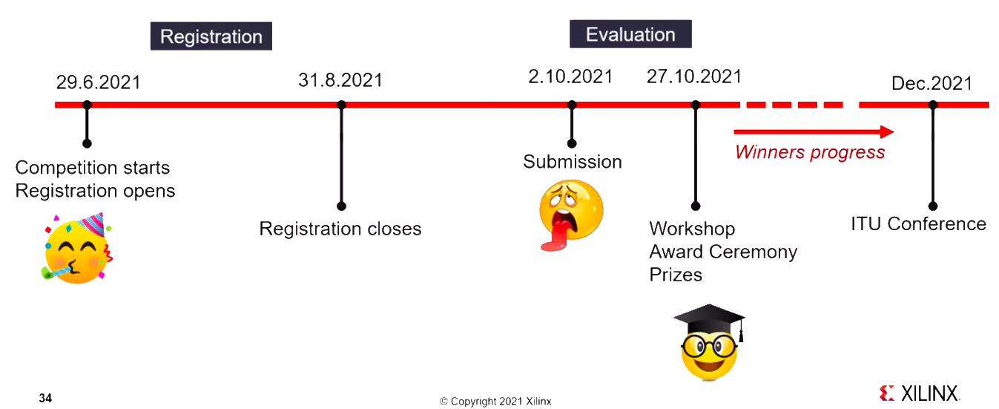

# BacalhauNetV1 for ITU-ML5G-PS-007
<a href="./images/capitaoportugal.jpeg">
  
</a>

___


## Table Of Contents
- [BacalhauNetV1 for ITU-ML5G-PS-007](#bacalhaunetv1-for-itu-ml5g-ps-007)
  - [Table Of Contents](#table-of-contents)
  - [Metrics](#metrics)
  - [File Description](#file-description)
  - [Instructions for reproduction:](#instructions-for-reproduction)
  - [FAQ:](#faq)
  - [Visualization](#visualization)
  - [Team BacalhauNet](#team-bacalhaunet)
  - [Challenge Description](#challenge-description)
    - [Goal](#goal)
    - [Timeline](#timeline)
    - [Evalution Criteria](#evalution-criteria)
    - [Criteria for valid submissions](#criteria-for-valid-submissions)
    - [Reproducibility](#reproducibility)
    - [Inference Cost](#inference-cost)
    - [Custom Operations](#custom-operations)
    - [Dataset](#dataset)
    - [Train/Test Split](#traintest-split)
    - [Resources](#resources)
    - [Challenge Organizers](#challenge-organizers)

___


## Metrics
**Overall test accuracy reached:** `0.562410`

**Inference cost score reached:** `0.016211`

**Complete output dictionary printed by the inference_cost() function:**
``` shell
Inference cost for models/model_export.onnx
{
  "discount_sparsity": true,
  "mem_o_FLOAT32": 93208.0,
  "mem_w_SCALEDINT6": 1784.0,
  "op_mac_FLOAT32_SCALEDINT6": 46976.0,
  "op_mac_SCALEDINT8_SCALEDINT6": 18973.0,
  "op_mac_SCALEDUINT6_SCALEDINT6": 258688.0,
  "total_bops": 19242864.0,
  "total_mem_o_bits": 2982656.0,
  "total_mem_w_bits": 10704.0,
  "unsupported": "set()"
}
```

___


## File Description
**Path to .onnx model within this zipfile:** `./bacalhaunet_gold_export.onnx`

**Path to .pth checkpoint within this zipfile:** `./bacalhaunet_gold_weights.pth`

___


## Instructions for reproduction:
1. Required python packages must be installed:
   - `pip install odfpy`
2. Environment variables must be set according to `https://github.com/Xilinx/brevitas-radioml-challenge-21` instructions.
3. Execute script `run-docker.sh`.
4. Within docker, go to notebooks directory.
5. Open a terminal instance and execute `script.sh`.
6. When train is complete, the final weights are saved on `outputs/finalweights.pth`.
7. Jupyter notebook `evaluation.ipynb` may be used to confirm accuracy and inference cost score.

___


## FAQ:
1. Why didn't my model reach 56% test accuracy?
   - The 56% test accuracy treshold may not be reached since it depends on the weights initialisation. To overcome this issue you can either run the train process multiple times until you get the 56% test accuracy threshold or load the weights produced after the train procedure and before the 1st prune.
2. How can I load the authors model weights to reach the 56% test accuracy?
   - Open `./notebooks/bacalhaunet_quant_reg_prune1.py`
   - Uncomment line 300.
   - Run the commands below:
   ``` bash
   python3 bacalhaunet_quant_reg_prune1.py run_config.ods outputs outputs /workspace/dataset/GOLD_XYZ_OSC.0001_1024.hdf5
   python3 bacalhaunet_quant_reg_prune2.py run_config.ods outputs outputs /workspace/dataset/GOLD_XYZ_OSC.0001_1024.hdf5
   python3 bacalhaunet_quant_reg_prune3.py run_config.ods outputs outputs /workspace/dataset/GOLD_XYZ_OSC.0001_1024.hdf5
   ```

___


## Visualization
<table border="2px">
  <tr>
    <th>Unquantized (PyTorch) BacalhauNetV1</th>
    <th>Quantized (Brevitas) BacalhauNetV1</th>
  </tr>
  <tr>
    <td align="center">
      <a href="./images/bacalhaunetv1.png">
        
      </a>
    </td>
    <td align="center">
      <a href="./images/bacalhaunetv1_quant.png">
        </td>
      </a>
  </tr>
</table>

___


## Team BacalhauNet
- Daniel Granhão: daniel.granhao@fe.up.pt
- José Rosa: 2190383@my.ipleiria.pt
- Guilherme Carvalho: guilherm3.c@gmail.com
- Tiago Gonçalves: tiago.f.goncalves@inesctec.pt

___


## Challenge Description
### Goal
Use quantization, sparsity, custom topology design and other training techniques to design a neural network that achieves a minimum of 56% accuracy on the [RadioML 2018.01A](https://www.deepsig.ai/datasets) dataset.
Submissions will be ranked according to the inference cost function we define, and the lowest inference cost will win. Check under the [Evaluation criteria](#evalution-criteria) tab for details.


<div style="font-size: 10px;">
<b>Background:</b>
<i>The ever-growing demand for wireless data is driving a need for improved radio efficiency, of which a key component is improved spectral allocation via high quality spectrum sensing and adaptation. A key component for solutions such as Dynamic Spectrum Access (DSA) and Cognitive Radio (CR) is Automatic Modulation Classification (AMC), where the high-level goal is to monitor the RF spectrum and determine the different modulations being used. This information is subsequently used to reach transmission decisions that transmit information more efficiently. Prior works have successfully applied deep learning to AMC, demonstrating competitive recognition accuracy for a variety of modulations and SNR regimes.</i>
<i>To reap the benefits of AMC with deep learning in practice, an important challenge remains: modulation classification should be performed with low latency and high throughput to accurately reflect the current status of the transmissions. Inference with common deep neural networks can involve hundreds of millions of multiply-accumulate operations and many megabytes of parameters, which makes line-rate performance very challenging. A body of research [4, 5, 6] seeks to address these challenges applying quantization to weights and activations, pruning, novel topology design and pruning, which may be done in a co-designed fashion with hardware [7, 8] to provide the required system-level throughput. As this typically comes at the cost of some classification accuracy, multiple solutions offering different throughput at different levels of accuracy may be created.</i>
 </div>


### Timeline
- 2021-06-29 : Competition starts, registration opens
- 2021-08-31 : Registration closes, submissions open
- 2021-10-02 : Deadline: submissions close
- 2021-10-27 : Workshop: winners announced, awards ceremony
- 2021-10-31 to 2021-11-30 : ITU Judges Panel
- 2021-12-05 to 2021-12-10 : Grand Challenge Finale

<a href="./images/timeline.png">
  
</a>


### Evalution Criteria
**Last updated: 2021-06-24**

- Registration and submission deadlines are given in the Timeline tab.
- Registration and submission will take place on the ITU AI for Good Challenge Portal.
- Teams can consist of up to 4 individuals.
- Submissions will be evaluated and ranked after the submission period closes.
- Valid submissions (see [Criteria for Valid Submissions](#criteria-for-valid-submissions)) will be ranked in ascending value (**lower is better**) of the inference cost score (see [Inference Cost](#inference-cost)).


### Criteria for valid submissions
Submissions must fulfill the following criteria to be considered valid:

- The format for the submission must be a zipfile including:
  1. the filled out submission form (from the sandbox), 
  2. full source code, exported ONNX model with batch-1,
  3. trained .pth checkpoint,
  4. Dockerfile and instructions on how to reproduce the submission.
- Must include a neural network implemented with [PyTorch](https://pytorch.org/) and [Brevitas](https://github.com/Xilinx/brevitas) for [RadioML 2018.01A](https://www.deepsig.ai/datasets) classification.
- Must provide a Dockerfile to build a Docker container with all required dependencies. Evaluation in terms of accuracy validation, ONNX export and inference cost measurement will be done inside this Docker container.
- Must include all source code used for training, validation and export of the neural network to be end-to-end reproducible (from training to ONNX export) using the submitted zipfile. See extra notes in [Reproducibility](#reproducibility).
- Must use BrevitasONNXManager to export the ONNX file (as shown in the Jupyter notebook in the sandbox).
- Must capture all operations involved in going from [RadioML 2018.01A](https://www.deepsig.ai/datasets) data to modulation classification result in the PyTorch model and the exported ONNX. For instance, if there is any pre/post-processing this must be captured in both the PyTorch model and the exported ONNX.
- Must respect the provided train-test split (from the sandbox) for [RadioML 2018.01A](https://www.deepsig.ai/datasets) for training.
- Must reach at least 56.000% accuracy averaged across all modulations and all SNRs present in [RadioML 2018.01A](https://www.deepsig.ai/datasets) on the test set (for the provided train-test split in the sandbox). The accuracy will be measured (using the Docker container) on the submitted trained .pth checkpoint and code. Extra accuracy over this threshold will not bring benefits for the score.
- Must be able to compute the inference cost using the latest official implementation, see notes under Inference Cost. The cost will be measured (using the Docker container) on the submitted ONNX model. See also exceptions under Custom Operations.
- If using quantization, must use Brevitas for quantized layers, with uniform quantization with zero-point=0 for weights and activations. Different weights and activations may use different bitwidths. Other forms of quantization not built with Brevitas, including PyTorch native quantization, is not supported.
- Must be made open-source on a publicly accessible URL after the submission deadline has passed.


### Reproducibility
- Because of inherent difficulty in reproducing training results exactly, a submission will be considered valid as long as it can be independently reproduced to reach the minimum required accuracy threshold, whether the reproduced accuracy matches the submitted one exactly or not.
- Any submission that cannot be reproduced (in terms of training, validation, export or inference cost) because of issues with setup, dependencies, etc. won’t be considered valid, independently of what it claims to achieve.


### Inference Cost
- The **inference cost will be measured on the exported ONNX graph with input shape (1, 2, 1024) by using the official implementation**. The exported graph is static regardless of the values of the input tensor.
- The **official implementation for the inference cost function will be provided in the latest version of the feature/itu_competition_21 branch of the Xilinx/finn-base GitHub repository, with the inference_cost() function call in this file as the entry point**. The per-layer inference cost analysis functions can be found here.
- The organizers reserve the right to update the inference cost function implementation to fix bugs and provide improvements.
- If the inference cost function implementation and the explanation in this document disagree, the organizers will resolve this accordingly.
- The procedure in the Custom Operations section must be followed to account for the inference cost of any custom operations not currently supported by the latest inference cost function implementation.
- The custom ONNX export and inference cost measurement will be done as shown in the Jupyter notebook in the sandbox.
- The inference cost will **take into account the number of multiply-accumulate (MAC) operations and number of parameters for Conv, MatMul and Gemm ops assuming a naive/direct implementation** (e.g. no Winograd for convolutions).
- The **following layers are assumed to be zero-cost and will not be taken into account for the inference cost**:
  1. elementwise nonlinearities,
  2. pooling,
  3. reshape/transpose/concat,
  4. batch normalization,
  5. Mul/Div and Add/Sub for applying biases or quantization scaling factors.
These layers are elementwise and/or otherwise have little impact on total cost of inference based on existing DNN topologies.
- The inference cost will **discount for parameter sparsity** by discounted_mac = mac * (num_nonzero_ops/num_total_ops) and discounted_mem = mem * (num_nonzero_params/num_total_params) for each layer. **Activation sparsity and any other form of dynamic sparsity is not taken into account**.
- The inference cost will account for precision as follows: bit_ops = discounted_mac * weight_bits * act_bits and bit_mem = discounted_mem * weight_bits for each layer.
- For ranking, the inference cost will be converted to a score by normalizing against the inference cost of the provided baseline model as follows: score = 0.5*(bit_ops/baseline_bit_ops) + 0.5*(bit_mem/baseline_bit_mem). The scores will be ranked low-to-high (i.e. lower is better).


### Custom Operations
Participants are **allowed to implement custom layers and quantizers, as long as they can be exported through the existing ONNX flow and the organizers approve the inference cost computation**. For fairness, the custom layers and their inference cost computation must be made available to all participants.

- If you want to use custom operations, the workflow is as follows:
  1. Get in touch with the organizers as soon as possible (see the Contact tab) but defintiely no later than **2nd September (1 month ahead of the submission deadline)** to explain which custom operation(s) you would like to implement, and make a suggestion for how to calculate the inference cost for these operations.
  2. For the inference cost of your custom operation(s): if dominated by MACs, the compute (bit_ops) and memory cost (bit_mem) can be computed in a similar way to the existing Conv and MatMul operations, which can be found here. For all other operations and computations, you must check separately with the organizers. A mapping to Xilinx FPGA LUTs by Vitis High-Level Synthesis will serve as the basis for the inference cost calculation.
  3. The organizers will review your suggested ops and inference cost formula, and may ask for modifications. Whether your custom op and its inference cost will be approved is at the discretion of the organizers.
  4. Once your proposal is approved, you will be asked to send a Pull Request (PR) to the inference cost implementation function, which will be reviewed and merged. Your custom ops are then valid for submission, and also available for other participants to use.


### Dataset
This challenge uses the [RadioML 2018.01A](https://www.deepsig.ai/datasets) dataset provided by DeepSig. You will be required to provide your contact information to download the dataset.
Please note that this dataset is released by DeepSig under the Creative Commons Attribution - NonCommercial - ShareAlike 4.0 License and you must abide by the terms of this license to participate in our challenge.


### Train/Test Split
Please note that we use a **fixed train/test split on the dataset for a fair comparison, and you must abide by this in order to provide a valid submission**. This **split is given by the fixed random seed and other parameters in the Jupyter notebook we provide in the sandbox**.


### Resources
- Chat with challenge organizers & participants: [https://github.com/Xilinx/brevitas-radioml-challenge-21/discussions](https://github.com/Xilinx/brevitas-radioml-challenge-21/discussions)
- Questions related to quantization-aware training with Brevitas: [https://gitter.im/xilinx-brevitas/community](https://gitter.im/xilinx-brevitas/community)
- Sandbox environment: [https://github.com/Xilinx/brevitas-radioml-challenge-21](https://github.com/Xilinx/brevitas-radioml-challenge-21)
  - Sandbox contains everything you need to make a submission to this challenge. This includes a Docker environment with PyTorch and Brevitas, and Jupyter notebook demonstrating how to train, validate and evaluate the hardware cost of the baseline network.
- Baseline network: [https://arxiv.org/pdf/1712.04578.pdf](https://arxiv.org/pdf/1712.04578.pdf)
  - A version of the VGG10 CNN architecture proposed by the RadioML dataset authors in [Over-the-Air Deep Learning Based Radio Signal Classification](https://arxiv.org/pdf/1712.04578.pdf). The baseline network is trained with quantization-aware training in Brevitas, using 8-bit quantization for both weights and activations, and gets 59.82% average accuracy across all modulations and SNR levels. You can find a pretrained PyTorch checkpoint in the sandbox, as well as the Python code to train the network from scratch in the provided Jupyter notebook.
- Kickoff webinar slides and recording: [Not Found: 404](https://github.com/pinxau1000/) and [https://www.youtube.com/watch?v=Mn4_1YeS-IM&ab_channel=AIforGood](https://www.youtube.com/watch?v=Mn4_1YeS-IM&ab_channel=AIforGood)
- Brevitas Getting Started and Notebooks: [https://github.com/Xilinx/brevitas/#getting-started](https://github.com/Xilinx/brevitas/#getting-started) and [https://github.com/Xilinx/brevitas/tree/master/notebooks](https://github.com/Xilinx/brevitas/tree/master/notebooks)
- FINN: [https://xilinx.github.io/finn/](https://xilinx.github.io/finn/)
  - Although this challenge does not require you to accelerate the neural networks that you train, FINN is a good choice for turning Brevitas-trained quantized neural networks into dedicated FPGA accelerators.


### Challenge Organizers
- Alessandro Pappalardo (alessand at xilinx.com)
- Felix Paul Jentzsch (felixj@xilinx.com)
- Michaela Blott (mblott at xilinx.com)
- Yaman Umuroglu (yamanu at xilinx.com)
